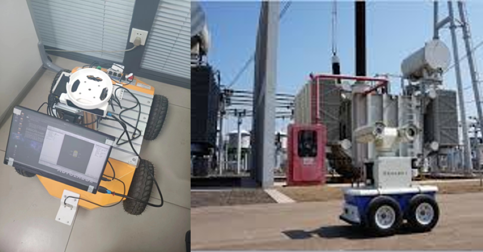
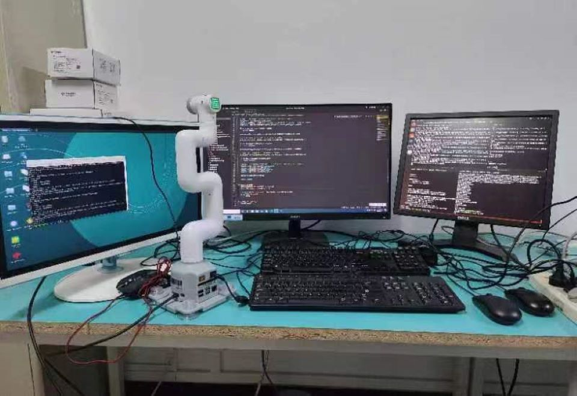
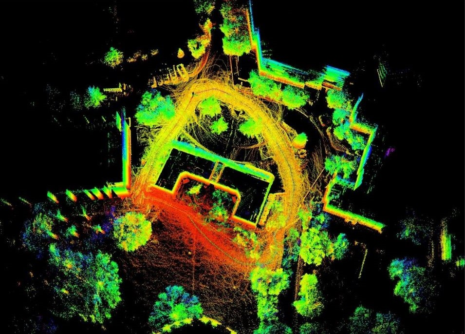

# BIT-Unmanned-System-Understanding-and-Navigation-Lab
Unmanned system perception and navigation laboratory featuring virtual reality fusion and embodied intelligence

# 北京理工大学智能无人系统感知与导航实验室
以虚实融合和具身智能为特点的无人系统感知与导航实验室

## 研究方向
### 恶劣环境下的融合3D目标检测
多模态3D目标检测是当前自动驾驶领域的主流感知手段，它可以提供道路上的障碍物信息，供自动驾驶系统进行行动决策。实际的行驶环境比较多变，雨雪等恶劣天气会导致感知算法的性能大大下降，为了解决雨雪等恶劣天气对感知效果的影响，将天气的变化视为域偏移问题，采用域对抗网络的形式，在不依赖大量标注数据的条件下，实现提高恶劣环境下检测精度的目的。

### 多传感器融合目标检测算法研究
主要分为  
1.基于图像的2D目标检测算法  
2.基于多传感器融合的3D目标检测算法。  
目前正在研究相机-毫米波雷达-激光雷达的融合检测算法

### 基于感知融合的3D目标检测

利用双目相机和激光雷达获取的信息进行3D目标检测，将获取的信息以及检测结果发布到ROS平台上，以支持后续信息处理。  

### 无人船虚实融合训练系统
+ 基于unity搭建虚拟仿真训练环境
+ 基于马尔可夫决策设计避障任务
+ 基于深度强化学习算法和Pytorch深度学习框架训练模型
+ 基于ROS和C#通信机制实现虚实结合
+ 基于混合现实眼镜实现虚实融合展示

### 面向智能巡检的无人车虚实融合导航避障算法研究
随着无人车技术的不断发展，智能巡检成为了许多领域中提高效率和降低人力成本的重要手段。无人车巡检系统可以在工业、城市、农业等领域中执行自主导航和巡检任务，检测和监控环境中的物体和设施。  
其中，无人车导航避障算法是实现智能巡检的核心技术之一。该方向主要采用强化学习算法研究无人车在复杂的环境中规划路径、感知障碍物并进行避障，确保无人车安全、高效地完成巡检任务。

### 机械臂虚实融合运动控制系统算法研究
以实验室软硬件实验平台为依托，利用ChatGPT定制用户与机器人的交互媒介，基于计算机视觉算法捕获用户希望抓取目标物体的位姿信息，通过运动控制算法实现机械臂各关节的轨迹规划，最终达到机械臂自动抓取指定目标的效果。  

### 面向xxxx的SLAM（同步定位与地图构建）建图算法研究
主要研究方向为移动机器人信息感知与导航，通过激光雷达扫描的点云信息构建环境的3维地图，并将其用于导航，以解决机器人在未知环境运动时的定位与地图构建问题。

## 最新成果

### 发表论文：
标题： [研究成果的标题]

作者： [成果的作者列表]

会议/期刊： [发表成果的会议或期刊名称]

摘要： [研究成果的摘要或简介]

链接： [可选，指向该成果的在线资源链接]

### 项目进展：

项目名称： [项目的名称]

项目描述： [项目的简要描述]

项目成员： [参与该项目的实验室成员列表]

项目状态： [项目的当前状态，如进行中、已完成等]

### 资源公开：
实验室内部的文档、数据集、代码示例等

资源名称： [资源的名称]

描述： [资源的简要描述]

链接： [指向资源的在线链接]

## 问题反馈： 

如果您发现问题或有改进建议，您可以在此处提交问题或提出建议。

## 联系我们：

